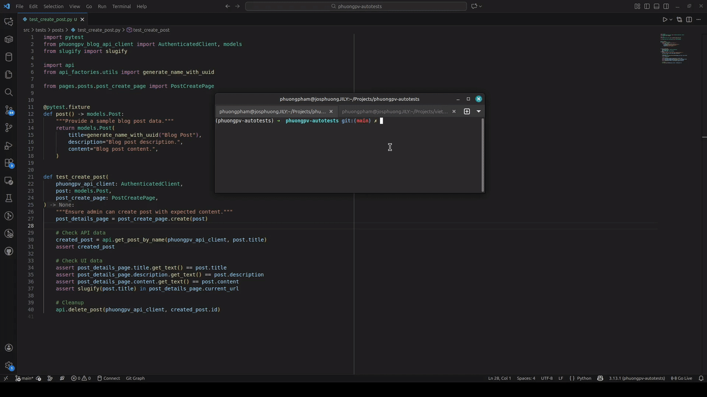

# Description

This repository contains `Selenium` tests for `PhuongPV` project.

`test_create_post` running example:



If you are new to autotests - checkout [pomcorn](https://github.com/saritasa-nest/pomcorn), its docs and tutorial.

## Installing project for developing on local PC

You have to have the following tools installed prior initializing the project:

- [uv](https://github.com/astral-sh/uv)
- [poetry](https://python-poetry.org/docs/#installation)

### TL;DR

If you already configured uv, poetry, and webdrivers, you may use
following commands to start local development:

```bash
uv venv --python 3.13 --prompt phuongpv-autotests --seed
source .venv/bin/activate
poetry install --only local
inv project.init
```

### Prepare python env

1. Install python:

   ```bash
   uv python install 3.13
   ```

2. Config poetry and install build tools:

```bash
poetry config virtualenvs.in-project true && poetry install --only local && source .venv/bin/activate
```

3. Start project initialization that will set up python/system env, update and install dependencies:

```bash
inv project.init
```

### Task runner

For easier running of everyday tasks, like:

- run dev server
- run all tests
- run linters
- run celery workers
- ...

We use [invoke](https://pypi.org/project/invoke/).

It provides shortcuts for most of the tasks, so it's like collection of bash scrips
or makefile or `npm scripts`.

To enable autocompletion of invoke commands add this line to your `~/.zshrc`

```console
source <(inv --print-completion-script zsh)
```

### Web Driver

To run tests you need to have web browser and webdriver.

Recent Selenium versions contain beta version of
[Selenium Manager](https://www.selenium.dev/documentation/selenium_manager/) - tool that prepare
webdriver by itself. So simply run tests with any supported webdriver, and selenium **should**
prepare browser and driver by itself. If for some reason this won't work - proceed with instructions
below.

Example:

```console
pytest -k test_successful_login
```

#### Web Driver for Windows

##### By using chocolatey

Open `powershell` as `admin`

Installing [Chrome Driver](https://chocolatey.org/packages/chromedriver)

```console
choco install chromedriver
```

#### Windows terminal (Windows only)

Set up [Windows Terminal](https://github.com/microsoft/terminal) for easier
working with CLI utilities, set it as default for your IDE.
Installing [Geckodriver for Firefox](https://chocolatey.org/packages/selenium-gecko-driver)

```console
choco install selenium-gecko-driver
```

Upgrading

```console
choco upgrade selenium-gecko-driver
choco upgrade chromedriver
```

##### Manual

- [Chrome Driver](https://sites.google.com/a/chromium.org/chromedriver/home)
- [Geckodriver for Firefox](https://github.com/mozilla/geckodriver/releases)

Unzip and put `.exe` in `C:\Windows` or add the path to your webdriver
in the `PATH` system variable:

```console
export PATH=$PATH:/path/to/driver/browser-driver
```

#### Web Driver for Linux

- Via package managers
  - [Chrome Driver](https://command-not-found.com/chromedriver)
  - [Chromium(comes with driver same as Chrome Driver)](https://command-not-found.com/chromium)
  - [Geckodriver for Firefox](https://command-not-found.com/geckodriver)
- Manually
  - [Chrome Driver](https://sites.google.com/a/chromium.org/chromedriver/home)
  - [Geckodriver for Firefox](https://github.com/mozilla/geckodriver/releases)

#### Web Driver for Mac

Installing [Chrome Driver](https://formulae.brew.sh/cask/chromedriver)

```console
brew install chromedriver
```

Installing [Geckodriver for Firefox](https://formulae.brew.sh/formula/geckodriver#default)

```console
brew install geckodriver
```

- Manually
  - [Chrome Driver](https://sites.google.com/a/chromium.org/chromedriver/home)
  - [Geckodriver for Firefox](https://github.com/mozilla/geckodriver/releases)

#### Note about drivers

Also, don't forget to `install` or `update` browsers. For example version of `chrome` and `chromedriver` must
match. You can test it by simply running in console `chromedriver` or `geckodriver`, if there are no errors, then
press `ctrl+c` to exit.
